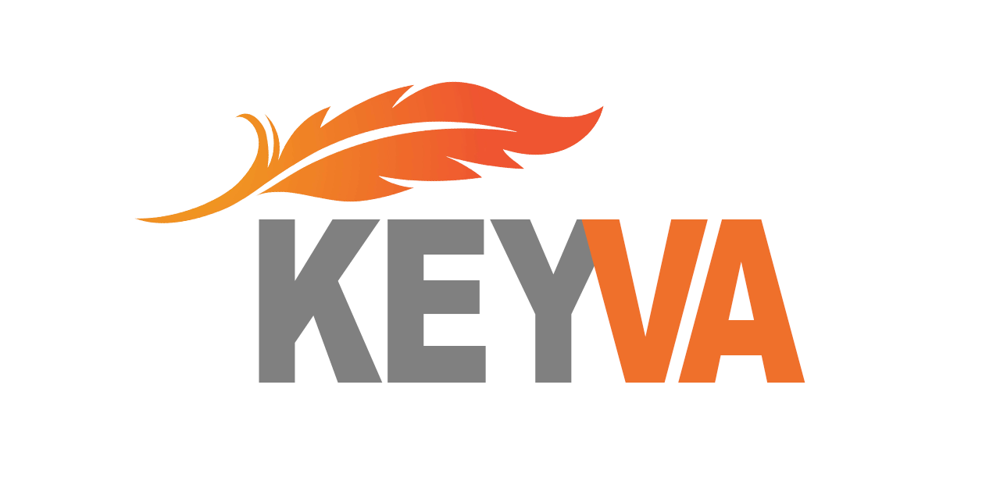

<p align="center">
	
</p>

# What is Keyva?

Keyva is a feather-weight zero-dependency TypeScript library that gives you key/value access to IndexedDB. It's as easy to use as localStorage, but still manages to expose a lot of the power of IndexedDB, such as complex object storage, binary data storage, indexes, and querying.

## Why Keyva?

There are [many existing IndexedDB abstractions](https://www.paultman.com/best-library-for-indexeddb-localforage-idb-keyval-or-idb/). While these projects meet some definition of *functional*, a library design aficionado like myself finds them lacking in elegance. **This matters**. Especially for a key/value access layer which is going to be used in literally every app I'm going to build.

Some libraries have carefully designed APIs where significant care was obviously given to the interface rather than only focusing on the implementation. These libraries place a very high value on ergonomics, simplicity, elegant naming, minimizing cognitive load, and achieving the best possible Intellisense experience. These libraries have **staying power**. They're the type you keep reaching for **year after year**.

I didn't find any key/value access layer that inspired this level of confidence. So I designed one that does.

## Features

- Simple like localStorage, but powerful like IndexedDB.
- Feather-weight. Only **1.7KB** zipped + minified.
- Zero dependencies
- Written in TypeScript. Code is commented and readable.

## Usage

Start by creating a `Keyva` object, which creates a new IndexedDB database with a default name:

```typescript
const kv = new Keyva();
```

The `Keyva` class only has 4 methods: `.get()`, `.set()`, `.delete()`, and `.each()`. These methods have a few overloads, but otherwise, this is essentially the entire library.

```typescript
// Writing
await kv.set("some-key", "some-value");

// Reading
const value = await kv.get("some-key");

// Deleting
await kv.delete("some-key");

// Iteration
for (const [key, value] of await kv.each()
{
	// Do stuff
}
```

## Advanced Usage

Get all keys and values from a Keyva:

```typescript
const all = await kv.get();
```

Get multiple values at once:

```typescript
const all = await kv.get(["key1", "key2"]);
```

Set multiple values at once:

```typescript
await kv.set([["k0", "v0"], ["k1", "v1"], ["k2", "v2"]]);
```

For more complete usage examples, see the [tests file](https://github.com/paul-go/keyva/blob/master/Keyva.cover.ts)

## Shameless Plug

Do you need a world class player who can architect complex projects, design & implement beautiful UIs, write production-grade compilers, manage engineering teams, and speak the language of business? I'm available for hourly consulting work. (See my [profile](https://github.com/paul-go) for contact info).
